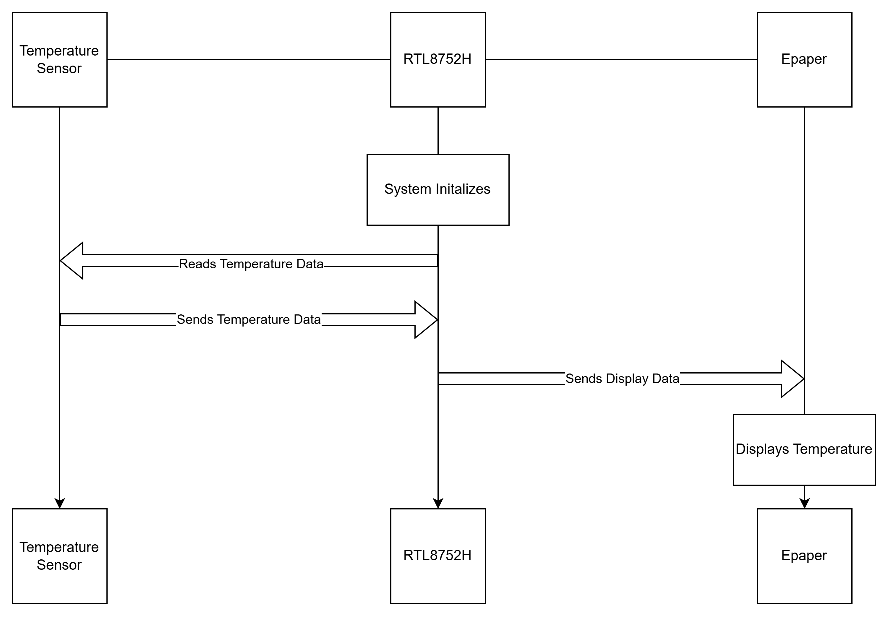

# Realtek RTL8752H SDK v1.3.0 First Mile

## Introduction on using the RTL8752H
Welcome to a tutorial introduction on the RTL8752H. Today, I will describe to you how you too can setup a simple project for the RTL8752H. For this project, we'll be going over how to use a few of the peripherals, some of the OS, and how to setup DLPS, our Deep Low Power Sleep system. 

So we're connecting our RTl8752H to two different sensors like so: 

# SPI

This first demo implements SPI master communication. The SPI peripheral (named SPI0) is configured to communicate with a e-paper display.

## Implementation
- `board_spi_init()`: Configures pinmux and pad settings for SPI0 (SCK, MOSI, MISO, CS)
- `driver_spi_init()`: Initializes the SPI peripheral with master mode settings

# GPIO

This demo demonstrates GPIO configuration with interrupt handling for button input and output control for e-paper display management.

## Key Features
- **Button Input with Interrupt**: Configured with falling-edge trigger, debounce (10ms), and interrupt handling
- **Output Control**: GPIO pins for e-paper display (DC, RST, PWR) and status monitoring (BUSY)
- **NVIC Integration**: Proper interrupt priority configuration for button press detection

## Implementation
- `board_gpio_init()`: Configures pad settings for all GPIO pins used
- `driver_gpio_init()`: Initializes GPIO peripheral with input/output modes and interrupt settings
- `GPIO_Input_Handler()`: Interrupt handler for button press that sends messages to the application task
- Pins configured:
  - `GPIO_BTN_PIN`: Input with interrupt for user button
  - `GPIO_DC_PIN`, `GPIO_RST_PIN`, `GPIO_PWR_PIN`: Outputs for e-paper control
  - `GPIO_BUSY_PIN`: Input for e-paper busy status monitoring

# I2C

This demo implements I2C master communication to read temperature data from a BMP280/BMP380 environmental sensor.

## Key Features
- **I2C Master Mode**: Configured at 10kHz clock speed for reliable communication
- **BMP280/380 Sensor Integration**: Reads temperature data from the barometric pressure sensor
- **7-bit Addressing**: Uses standard 7-bit I2C addressing (0x77 for BMP sensor)
- **Task-Based Operation**: Runs as an OS task that periodically reads temperature values

## Implementation
- `board_i2c_master_init()`: Configures pinmux for I2C0 (SCL on P0_6, SDA on P0_5)
- `driver_i2c_master_init()`: Initializes I2C0 peripheral in master mode
- `i2c_demo()`: OS task that connects to BMP sensor and reads temperature every 3 seconds
- `I2C0_Handler()`: Interrupt handler for I2C stop detection

# DLPS

- DLPS enter/exit callbacks switch pins between software and pinmux modes for power management

## Resources
- Product Information: https://www.realmcu.com/en/Home/Products/RTL8752H-Series
- Documentation: https://docs.realmcu.com/sdk/rtl8752h/common/en/latest/overview/text_en/readme.html
- HDK: https://www.realmcu.com/en/Resources/Hardware/RTL8752H-Series#pagetab
- Tools: https://www.realmcu.com/en/Resources/Tools/RTL87x2x_RTL877xG-Series#pagetab
- Training: https://www.realmcu.com/en/Home/Traininginfo
